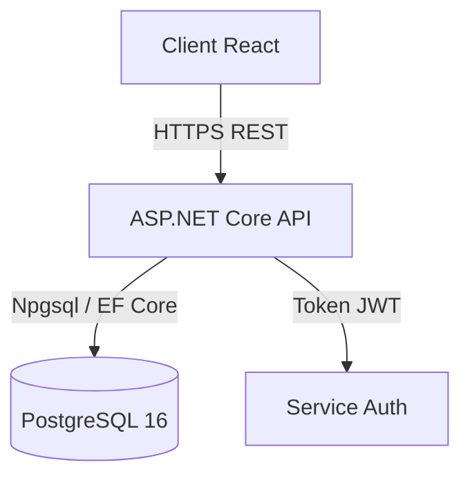

# PURPOSE
Rédiger et maintenir une documentation technique claire, vivante, structurée et immédiatement exploitable par les développeurs et exploitants du système.

# WHEN TO USE
- Création ou mise à jour de tout dépôt, module, service ou guide d'exploitation.

# PRINCIPLES
- **Modèle Diátaxis** : Distinguer clairement les Tutoriels (apprentissage), Guides pratiques (résolution d'un problème précis), Explications (compréhension conceptuelle) et Références (spécifications factuelles).
- **Proximité avec le Code** : Stocker la documentation en Markdown versionné dans le même référentiel Git que le code source.
- **Vérifiabilité** : Toute commande ou extrait de code documenté doit être testé et exécutable sans erreur.

# BEST PRACTICES
- Rédiger un `README.md` concis en racine contenant : prérequis, installation en une commande, lancement des tests et architecture synthétique.
- Utiliser la syntaxe textuelle Mermaid pour les diagrammes plutôt que des images binaires statiques.
- Tenir un journal des modifications (`CHANGELOG.md`) conforme aux standards Keep a Changelog.

# COMMON MISTAKES
- Laisser la documentation diverger du code réel au fil des sprints (dette documentaire).
- Insérer des mots de passe, tokens ou identifiants réels sous prétexte d'exemples concrets.
- Rédiger des blocs de texte fleuves sans titres, listes à puces ou diagrammes d'appui.

# WORKFLOW
1. Identifier la cible de lecture (développeur novice, mainteneur, exploitant).
2. Choisir le format adapté selon le modèle Diátaxis.
3. Rédiger le document Markdown avec des exemples concrets et vérifiés.
4. Intégrer les schémas textuels Mermaid nécessaires.
5. Revoir la validité des liens relatifs et des commandes.

# CHECKLIST
- [ ] Le document permet-il à un nouvel arrivant de reproduire la procédure de façon autonome ?
- [ ] Tous les blocs de code et commandes ont-ils été physiquement testés ?
- [ ] Aucun secret ni information confidentielle n'apparaît dans les textes d'exemple ?

# EXAMPLES
Diagramme de flux documenté en Mermaid :
